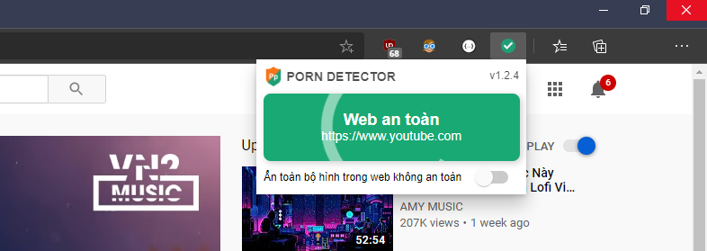

# Porn Detector Extension
> An frontend extension for porn detect server

    

# Require to build

-   Install newest version of `nodeJS`
-   Run `npm install -g win-node-env` in term

# Setup env build

## Step 1: Install node sources
-   Run `npm install` at root folder
-   Run `npm install` at `src/popup` folder

## Step 2: Development

-   Run `npm run watch` at root folder then add folder `dist` to extension

## Step 3: Production

-   Run `npm run build` to build sources
-   Then run `npm run zip` to build and zip file

# Technologies
+ NodeJS + TypeScript
+ ReactJS + Tachyon CSS + SCSS in popup